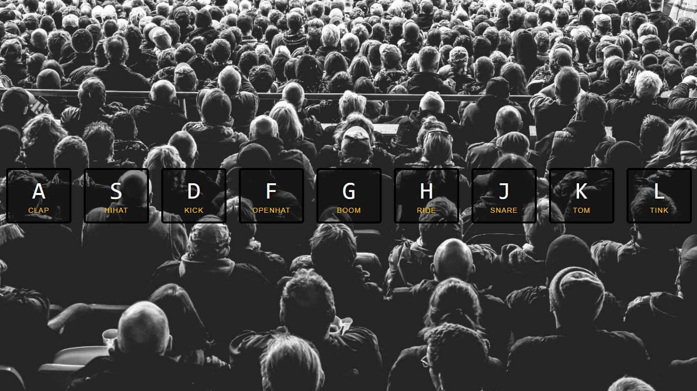

## JS-30-Day-1

<h1 align="center"> JS Drum Kit </h1>

> I learned How to prevent a delay in audio when hitting a key repeatedly and how to use `data-` to create our own html attributes.

##

### ✨ [Click for Demo](https://cenacrharsh.github.io/JS-30-Day-1/)



## Features & Usage

```sh
- Used attribute selector in JS for the first time.
- Used `data-` to create our own HTML attributes eg. data-key
- we used `audio.currentTime = 0` to prevent a delay when we play sound if we keep hitting a key repeatedly.
```
